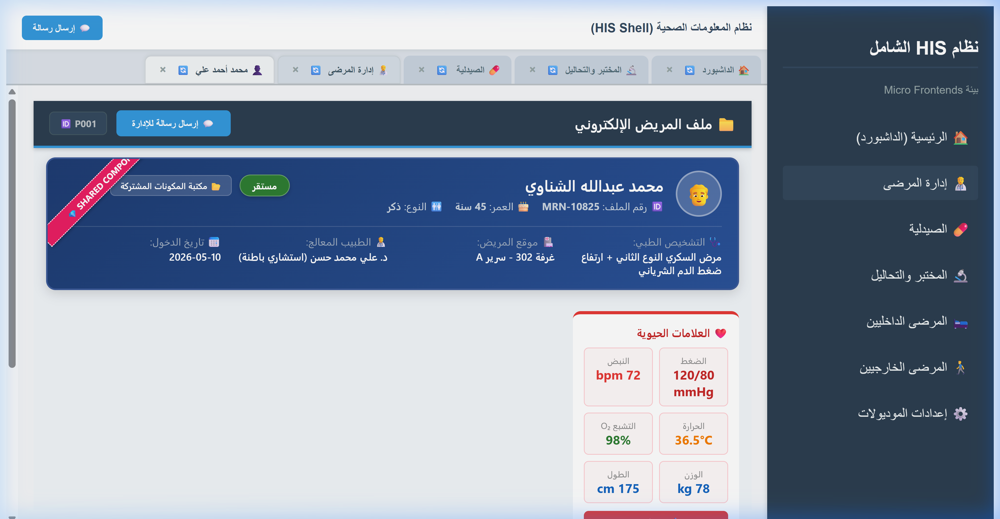
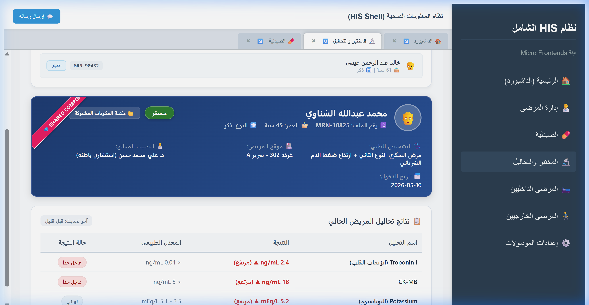
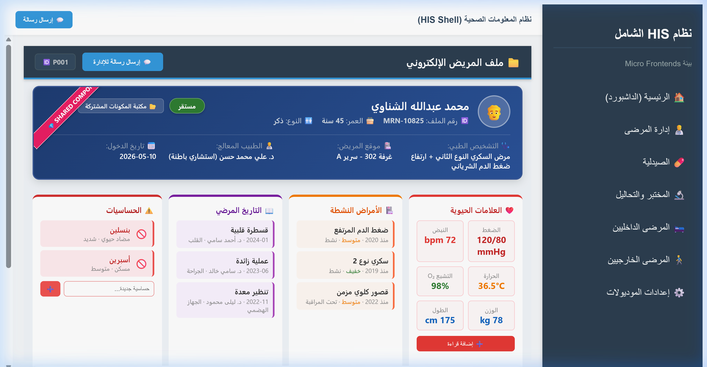
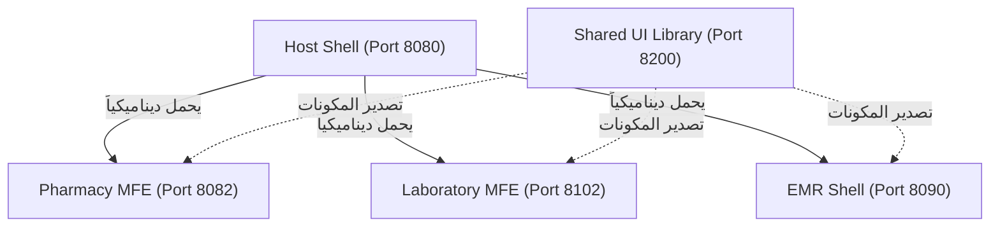

# نظام المعلومات الصحي الشامل (HIS Platform - Micro Frontends)

مرحباً بك في مستودع **نظام HIS الشامل لإدارة العمليات الصحية**. هذا النظام مبني بالكامل على بنية **Micro-Frontends (MFE)** باستخدام **Angular 18** و **Native Module Federation** لتوفير أداء فائق ومستقل تماماً لكل قسم طبي مع حماية كاملة ضد تكرار الأكواد.

---

## 💡 الفكرة العامة للمشروع (The Core Concept)

النظام عبارة عن بيئة متكاملة تدار عن طريق **Host Shell** رئيسية تقوم باحتضان وتحميل الموديولات الطبية بشكل ديناميكي أثناء وقت التشغيل (Runtime). تم تقسيم المستشفى الرقمي إلى مشاريع مستقلة تماماً:
*   **البوابة الرئيسية (Host Shell - Port 8080)**: الواجهة الكبرى وحارس المسارات وشريط التبويبات المرن.
*   **مكتبة الواجهات المشتركة (Shared UI Library - Port 8200)**: مكتبة المكونات الموحدة التي يتم استدعاء مكوناتها **ديناميكياً أثناء وقت التشغيل (Runtime Dynamic Loading)**.
*   **الملف الطبي الموحد (EMR Shell - Port 8090)**: النظام الطبي الإلكتروني الذي يربط التحاليل والروشتات والمؤشرات الحيوية للمريض.
*   **المختبر والتحاليل (Laboratory MFE - Port 8102)**: قسم التحاليل الطبية لإدخال ومراقبة مؤشرات الدم والقلب.
*   **الصيدلية الذكية (Pharmacy MFE - Port 8082)**: قسم صرف الأدوية وتتبع المخزون والوصفات النشطة.

---

## 🎨 لقطات حية وتكامل الأنظمة (Live Project Proofs)

### 🖥️ البوابة الرئيسية وقائمة المرضى (Host Shell):
شريط التبويبات الفاخر والأنيق مع خاصية الالتفاف التلقائي لحماية الواجهة عند زيادة التبويبات المفتوحة:


### 🔬 موديول المختبر والتحاليل تفاعلياً (Laboratory MFE):
تكامل مكون البحث والبانر المشترك مع تحديث تحاليل المريض خالد فوراً مع مؤشرات عاجلة وحرجة:


### 📁 ملف المريض الإلكتروني EMR بالبانر الموحد:
استدعاء البانر المشترك ديناميكياً من المكتبة المشتركة واستبدال اللوحة القديمة بالكامل:


---

## 📐 معمارية الموديولات الطبية (Architecture Diagram)


---

## 📋 المتطلبات والفرجانات المطلوبة (System Requirements)

لضمان بناء وتشغيل النظام دون أي تعارض، يجب توفر البرمجيات التالية بالفرجانات المحددة:

| البرمجية (Dependency) | الفرن الأدنى (Minimum Version) | الفرن الموصى به (Recommended) |
| :--- | :--- | :--- |
| **Node.js** | `v20.0.0` (LTS) | `v20.12.0` |
| **NPM** | `v10.0.0` | `v10.8.2` |
| **Angular CLI** | `v18.0.0` | `v18.2.0` |
| **Docker** | `v25.0.0` | `v26.0.0+` (Docker Desktop) |
| **Docker Compose** | `v2.20.0` | `v2.26.0+` |

---

## 🛠️ تسطيب وتركيب النظام (Installation & Setup)

لتشغيل المشروع بالكامل محلياً وفي ثوانٍ معدودة، نوصي باتباع الخطوات التالية:

### الخطوة 1: تنزيل الحزم محلياً (على حاسوبك المضيف)
نظراً لأن بعض الحزم تعتمد على بيئات التشغيل، قم بتثبيت الحزم محلياً أولاً لتهيئة المفسر الذكي لـ Angular:
```bash
# تثبيت حزم موديول المختبر
cd his-lab-mfe
npm install

# تثبيت حزم المكتبة المشتركة
cd ../his-shared-lib
npm install
```

### الخطوة 2: تشغيل المنظومة بالكامل عبر Docker Compose
قم بالعودة للمجلد الرئيسي وتشغيل نظام الحاويات. سيقوم Docker ببناء ونشر كافة التطبيقات الطبية على خوادم Nginx مستقلة وتوصيلها تلقائياً:
```bash
# تشغيل جميع الحاويات في الخلفية وبناء التحديثات
docker-compose up -d --build
```

---

## 💎 كيفية استخدام واستدعاء المكتبة المشتركة (Shared Library Usage)

المكتبة المشتركة `his-shared-lib` على منفذ `8200` هي النواة البرمجية الموحدة للمستشفى.

### 1. تصدير المكونات (Exposing Components)
داخل `federation.config.js` الخاص بالمكتبة، نقوم بتعريف المكونات المصدرة للجميع:
```javascript
const { withNativeFederation, shareAll } = require('@angular-architects/native-federation/config');

module.exports = withNativeFederation({
  name: 'his-shared-lib',
  exposes: {
    './PatientBanner': './src/lib/patient-banner/patient-banner.component.ts',
    './PatientSearch': './src/lib/patient-search/patient-search.component.ts',
  },
  shared: shareAll({ singleton: true, strictVersion: true, requiredVersion: 'auto' }),
});
```

### 2. استدعاء المكون ديناميكياً داخل موديول آخر (Dynamic Remote Loading)
لاستدعاء شريط بيانات المريض في موديول المختبر أو الصيدلية دون ربط مسبق أثناء البناء، استخدم المفسر الموحد:
```typescript
import { loadRemoteModule } from '@angular-architects/native-federation';

// في ملف الـ Typescript الخاص بالصفحة الطبية
async loadSharedBanner() {
  const module = await loadRemoteModule({
    remoteEntry: 'http://localhost:8200/remoteEntry.json',
    exposedModule: './PatientBanner'
  });
  
  const componentClass = module['PatientBannerComponent'];
  this.bannerHost.clear();
  const bannerRef = this.bannerHost.createComponent(componentClass);
  bannerRef.instance.patientId = this.currentPatientId; // ممرر الهوية ديناميكياً
  bannerRef.changeDetectorRef.detectChanges();
}
```

---

## 🔄 كيفية تواصل الموديولات - ناقل الأحداث (Message Bus / Event Bus)

تتواصل الموديولات بطريقة تفاعلية ومستقلة تماماً (Decoupled Reactive Communication) دون أي تداخل في الذاكرة عبر **ناقل الأحداث العام للمتصفح (Global Window Events)**.

### 1. إطلاق الحدث من حقل البحث المشترك (Dispatching Event)
عند اختيار مريض داخل مكون البحث المشترك:
```typescript
window.dispatchEvent(new CustomEvent('HIS_SHARED_PATIENT_SELECTED', {
  detail: { id: 'P001', name: 'محمد الشناوي', mrn: '10825' }
}));
```

### 2. التقاط الحدث وتحديث الـ DOM عبر `NgZone` (Receiving Event)
يجب التقاط الحدث داخل نطاق `NgZone` الخاص بـ Angular لضمان تحديث قيم المتصفح وتعديل الواجهات فوراً:
```typescript
constructor(private ngZone: NgZone) {}

ngOnInit() {
  window.addEventListener('HIS_SHARED_PATIENT_SELECTED', (e: any) => {
    this.ngZone.run(() => {
      this.currentPatientId = e.detail.id;
      this.loadPatientMedicalData(); // جلب البيانات الطبية للمريض المحدث
    });
  });
}
```

---

## 🚀 كيفية إضافة مشروع (Micro-Frontend) جديد للمنظومة

لإضافة موديول جديد (مثال: قسم الأشعة Radiology MFE على Port `8103`):

### الخطوة 1: إنشاء مشروع Angular standalone وتسطيب الفيدريشن
```bash
# إنشاء المشروع
ng new his-radiology-mfe --standalone --style=css --routing
cd his-radiology-mfe

# إضافة الفيدريشن الأصلي
ng add @angular-architects/native-federation --port 8103
```

### الخطوة 2: تسجيل الموديول في الشيل الرئيسي (`his-shell`)
قم بإضافة المكون في ملف التعريف `federation.manifest.json`:
```json
{
  "shared-lib": "http://localhost:8200/remoteEntry.json",
  "lab-mfe": "http://localhost:8102/remoteEntry.json",
  "radiology-mfe": "http://localhost:8103/remoteEntry.json" // الموديول الجديد
}
```
ثم قم بتسجيله في القائمة البرمجية `menus.config.ts` ليتم تصييره في شريط التبويبات الفاخر.

### الخطوة 3: التسجيل في Docker Compose
أضف الموديول الجديد في ملف `docker-compose.yml`:
```yaml
  his-radiology-mfe:
    build:
      context: ./his-radiology-mfe
      dockerfile: Dockerfile
    ports:
      - "8103:80"
```

---

## 📦 كيفية البناء والنشر للمواقع الإنتاجية (Publishing / Production Build)

يتم إنتاج ملفات بيلد مستقلة تماماً ومجهزة للعمل على أي خادم ويب (مثل Nginx أو IIS).

### 1. البناء على السيرفر المحلي (Host Compile)
لتوليد ملفات الـ HTML والـ Javascript المحسنة:
```bash
cd his-lab-mfe
npm run build --configuration=production
```
ستجد الملفات الناتجة في مجلد `/dist/his-lab-mfe/browser`.

### 2. البناء والنشر السحابي التلقائي (Docker Nginx Package)
لقد قمنا بتهيئة ملفات الـ `Dockerfile` لتعتمد على مرحلة نقل خفيفة جداً تصدر الملفات المبنية مباشرة إلى خادم Nginx، مما يمنح استقراراً وحماية كاملة ضد بطء السيرفرات:
```dockerfile
FROM nginx:alpine
COPY dist/his-lab-mfe/browser /usr/share/nginx/html
COPY nginx.conf /etc/nginx/conf.d/default.conf
EXPOSE 80
CMD ["nginx", "-g", "daemon off;"]
```

---
*تم كتابة وتدقيق هذا الملف ليكون المرجع الشامل والأساس لبنية الـ Micro-Frontends الطبية.* 🌐🏥💎
