# 🏛️ المرجع المعماري الشامل والنهائي
## HIS Backend — .NET Core Hybrid Deployable Modular Architecture
### Multi-Tenant · Multi-Instance · Multi-Hospital · Independently Deployable Modules

> **هذا المستند هو المرجع الوحيد للمشروع — يجمع كل ما تم الاتفاق عليه**

---

## 📋 فهرس المحتويات

1. [الفلسفة والمبادئ الأساسية](#1-الفلسفة-والمبادئ-الأساسية)
2. [الهيكل العام للمنظومة](#2-الهيكل-العام-للمنظومة)
3. [السيناريوهات الأربعة الحقيقية](#3-السيناريوهات-الأربعة-الحقيقية)
4. [قاعدة البيانات المركزية — Central DB](#4-قاعدة-البيانات-المركزية)
5. [التسلسل الهرمي للمستخدمين — 3 مستويات](#5-التسلسل-الهرمي-للمستخدمين)
6. [الربط بين Central وTenant DBs](#6-الربط-بين-central-وtenant-dbs)
7. [تسجيل قاعدة بيانات جديدة وإضافة مستشفى](#7-تسجيل-قاعدة-بيانات-جديدة-وإضافة-مستشفى)
8. [طبقة الوصول للبيانات — DAL](#8-طبقة-الوصول-للبيانات)
9. [الـ Deploy المستقل لكل موديول](#9-الـ-deploy-المستقل-لكل-موديول)
10. [التواصل بين الموديولات — Cross-Module Communication](#10-التواصل-بين-الموديولات)
11. [هيكل الـ Solution وخطة التنفيذ](#11-هيكل-الـ-solution-وخطة-التنفيذ)

---

## 1. الفلسفة والمبادئ الأساسية

### المعادلة الذهبية للتصميم

```
استقلالية Deploy الميكروسيرفيسز
+
بساطة تطوير المونوليث
= HIS Deployable Modular Architecture
```

### القواعد الخمس التي لا تُكسر

| # | القاعدة | التفصيل |
|:---:|:---|:---|
| **1** | **عزل البيانات** | لا يوجد JOIN بين جداول موديولين مختلفين أبداً |
| **2** | **عزل الكود** | لا يوجد Project Reference من موديول لآخر أبداً |
| **3** | **GUID الموحد** | نفس الـ GUID يُستخدم PK في Central وTenant لتجنب Cross-DB Joins |
| **4** | **الـ Middleware يقرأ التوكن مرة واحدة** | كل المعلومات تُخزَّن في `ITenantContextAccessor` للـ Request |
| **5** | **كل موديول = Library + Host خفيف** | الـ Host مجرد `Program.cs` + `Dockerfile` فقط |

---

## 2. الهيكل العام للمنظومة

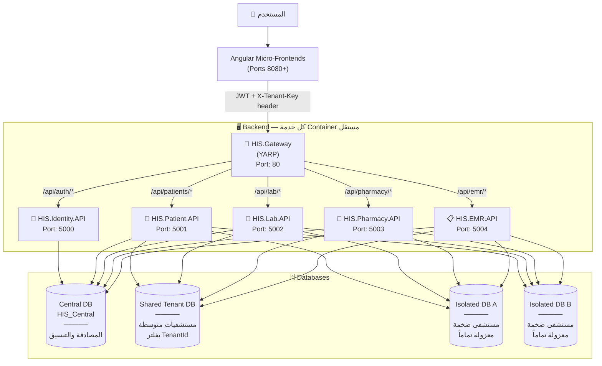

---

## 3. السيناريوهات الأربعة الحقيقية

| # | السيناريو | المثال الواقعي | الحل التقني |
|:---:|:---|:---|:---|
| **1** | مستشفيات متوسطة/صغيرة متعددة | مستشفى القناة + السلام + الرحمة | **Shared DB** + EF Global Filter بـ `TenantId` |
| **2** | مستشفى ضخمة وحيدة | مستشفى جامعة القاهرة | **Isolated DB** مستقلة — `SoleTenant` بدون Filter |
| **3** | مستشفى ضخمة تضم أخرى لاحقاً | جامعة القاهرة ← ينضم مركز القلب | **Isolated DB** تتحول لـ `SharedTenant` داخل نفس الـ Instance |
| **4** | مستخدم يعمل في أكثر من مستشفى | د. أحمد في السلام ومركز القلب | **UserTenantRoles** Many-to-Many بأدوار مختلفة |

---

## 4. قاعدة البيانات المركزية

### مخطط الـ ER الكامل (7 جداول)

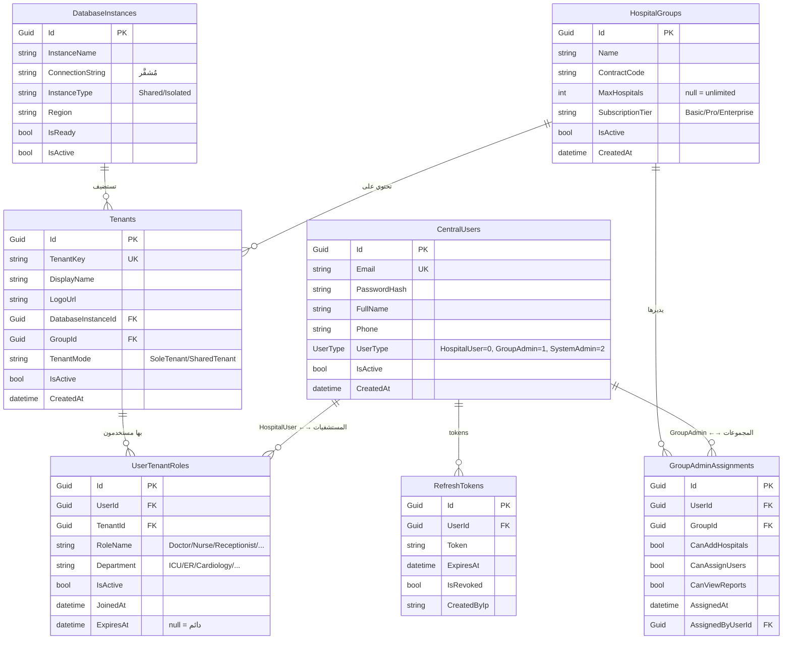

---

## 5. التسلسل الهرمي للمستخدمين

### الهرم الكامل

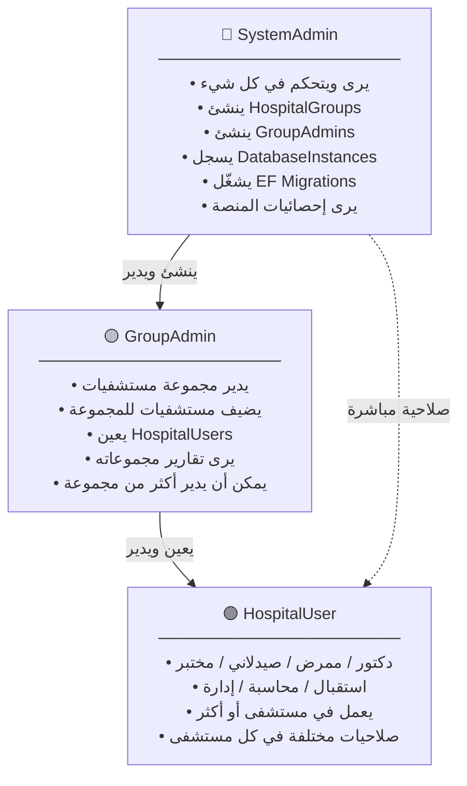

### جدول الصلاحيات التفصيلي

| الصلاحية | 🟢 HospitalUser | 🟡 GroupAdmin | 🔴 SystemAdmin |
|:---|:---:|:---:|:---:|
| عمل طبي داخل مستشفى | مستشفياته فقط | ✅ | ✅ |
| رؤية بيانات المرضى | مستشفياته فقط | مجموعاته فقط | الكل |
| إضافة مستشفى | ❌ | ✅ في مجموعاته | ✅ |
| تعيين موظف | ❌ | ✅ في مجموعاته | ✅ |
| إنشاء HospitalGroup | ❌ | ❌ | ✅ |
| إنشاء GroupAdmin | ❌ | ❌ | ✅ |
| تسجيل DB Instance | ❌ | ❌ | ✅ |
| إلغاء تفعيل مستشفى | ❌ | ✅ في مجموعاته | ✅ |
| تقارير المنصة كاملة | ❌ | مجموعاته فقط | ✅ |

### توليد الـ JWT لكل نوع مستخدم

```csharp
// HIS.Identity/Application/Services/AuthService.cs
public async Task<LoginResponseDto> LoginAsync(LoginRequestDto request)
{
    var user = await _centralDb.CentralUsers
        .FirstOrDefaultAsync(u => u.Email == request.Email && u.IsActive)
        ?? throw new UnauthorizedException("بيانات الدخول غير صحيحة.");

    if (!VerifyPassword(request.Password, user.PasswordHash))
        throw new UnauthorizedException("بيانات الدخول غير صحيحة.");

    var baseClaims = new List<Claim>
    {
        new(ClaimTypes.NameIdentifier, user.Id.ToString()),
        new(ClaimTypes.Email, user.Email),
        new(ClaimTypes.Name, user.FullName),
        new("user_type", user.UserType.ToString()),
    };

    return user.UserType switch
    {
        // ─── HospitalUser ──────────────────────────────────────────────────
        UserType.HospitalUser => await BuildHospitalUserResponse(user, baseClaims),
        // ─── GroupAdmin ────────────────────────────────────────────────────
        UserType.GroupAdmin   => await BuildGroupAdminResponse(user, baseClaims),
        // ─── SystemAdmin ───────────────────────────────────────────────────
        UserType.SystemAdmin  => await BuildSystemAdminResponse(user, baseClaims),
        _                     => throw new InvalidOperationException()
    };
}

private async Task<LoginResponseDto> BuildHospitalUserResponse(CentralUser user, List<Claim> claims)
{
    var userTenants = await _centralDb.UserTenantRoles
        .Include(utr => utr.Tenant)
        .Where(utr => utr.UserId == user.Id && utr.IsActive && utr.Tenant.IsActive)
        .Where(utr => utr.ExpiresAt == null || utr.ExpiresAt > DateTime.UtcNow)
        .ToListAsync();

    // كل مستشفى = claim مستقل يحمل الدور والقسم
    foreach (var ut in userTenants)
    {
        claims.Add(new Claim("tenant_key",                    ut.Tenant.TenantKey));
        claims.Add(new Claim($"role_{ut.Tenant.TenantKey}",  ut.RoleName));
        claims.Add(new Claim($"dept_{ut.Tenant.TenantKey}",  ut.Department));
    }

    return new LoginResponseDto
    {
        AccessToken      = GenerateJwtToken(claims),
        RefreshToken     = await GenerateRefreshToken(user.Id),
        UserType         = UserType.HospitalUser,
        AllowedHospitals = userTenants.Select(ut => new HospitalSummaryDto
        {
            TenantKey   = ut.Tenant.TenantKey,
            DisplayName = ut.Tenant.DisplayName,
            LogoUrl     = ut.Tenant.LogoUrl,
            UserRole    = ut.RoleName,
            Department  = ut.Department
        }).ToList()
    };
}
```

---

## 6. الربط بين Central وTenant DBs

### المبدأ: نفس الـ GUID في كل مكان

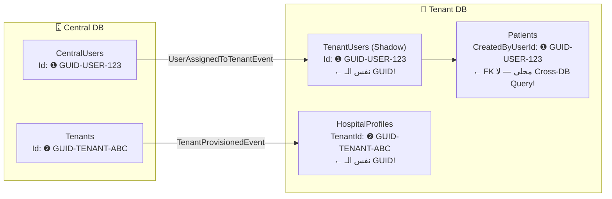

### جدول `TenantUsers` (Shadow User داخل Tenant DB)

| Column | Type | Description |
|:---|:---|:---|
| `Id` | `Guid` PK | **نفس** `CentralUsers.Id` تماماً |
| `FullName` | `NVarChar(200)` | للعرض المحلي |
| `RoleName` | `NVarChar(100)` | الدور في هذه المستشفى |
| `Department` | `NVarChar(100)` | القسم |
| `TenantId` | `Guid` | معرف المستشفى (للـ Shared Instances) |
| `IsActive` | `Bit` | نشط في هذه المستشفى |
| `SyncedAt` | `DateTime` | آخر مزامنة |

### جدول `HospitalProfiles` (داخل Tenant DB)

| Column | Type | Description |
|:---|:---|:---|
| `TenantId` | `Guid` PK | **نفس** `Tenants.Id` في Central DB |
| `Name` | `NVarChar(200)` | الاسم الرسمي |
| `LicenseNumber` | `NVarChar(50)` | رقم الترخيص الوزاري |
| `Address` | `NVarChar(500)` | العنوان |
| `TotalBeds` | `Int` | عدد الأسرة |
| `LogoUrl` | `NVarChar(500)` | الشعار للطباعة |
| `SubscriptionTier` | `Enum` | `Basic/Pro/Enterprise` |

### آلية المزامنة عبر الأحداث

```csharp
// عند إضافة مستخدم لمستشفى → يُطلق حدث → يُنشأ Shadow User في Tenant DB
public class UserAssignedToTenantEventHandler : IConsumer<UserAssignedToTenantEvent>
{
    public async Task Consume(ConsumeContext<UserAssignedToTenantEvent> context)
    {
        var ev = context.Message;
        var tenantCtx = await _tenantRegistry.GetTenantContextAsync(ev.TenantId);
        
        using var tenantDb = _tenantDbFactory.CreateFor(tenantCtx);
        var existing = await tenantDb.TenantUsers.FindAsync(ev.UserId);
        
        if (existing is null)
        {
            tenantDb.TenantUsers.Add(new TenantUser
            {
                Id         = ev.UserId,        // ← نفس الـ GUID من Central
                FullName   = ev.FullName,
                RoleName   = ev.RoleName,
                Department = ev.Department,
                TenantId   = ev.TenantId,
                IsActive   = true,
                SyncedAt   = DateTime.UtcNow
            });
        }
        else
        {
            existing.RoleName   = ev.RoleName;
            existing.Department = ev.Department;
            existing.SyncedAt   = DateTime.UtcNow;
        }
        
        await tenantDb.SaveChangesAsync();
    }
}
```

---

## 7. تسجيل قاعدة بيانات جديدة وإضافة مستشفى

### 7.1 تسجيل Instance جديدة

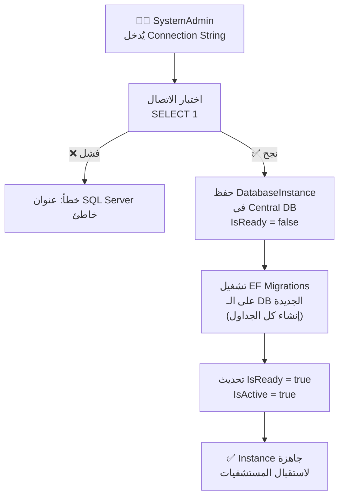

```csharp
// HIS.Identity/Application/Services/TenantProvisioningService.cs
public async Task<ProvisioningResult> RegisterDatabaseInstanceAsync(RegisterInstanceCommand cmd, CancellationToken ct)
{
    if (!await TestConnectionAsync(cmd.ConnectionString))
        return ProvisioningResult.Failed("لا يمكن الاتصال بقاعدة البيانات.");

    var instance = new DatabaseInstance
    {
        Id               = Guid.NewGuid(),
        InstanceName     = cmd.InstanceName,
        ConnectionString = _encryptor.Encrypt(cmd.ConnectionString),
        InstanceType     = cmd.Type,
        Region           = cmd.Region,
        IsReady          = false,
        IsActive         = false
    };
    _centralDb.DatabaseInstances.Add(instance);
    await _centralDb.SaveChangesAsync(ct);

    await RunMigrationsAsync(cmd.ConnectionString); // ينشئ الجداول

    instance.IsReady  = true;
    instance.IsActive = true;
    await _centralDb.SaveChangesAsync(ct);

    return ProvisioningResult.Success(instance.Id);
}
```

---

### 7.2 إضافة مستشفى جديدة — 3 سيناريوهات

#### السيناريو A: مستشفى جديدة على Shared Instance موجودة (الأسهل)

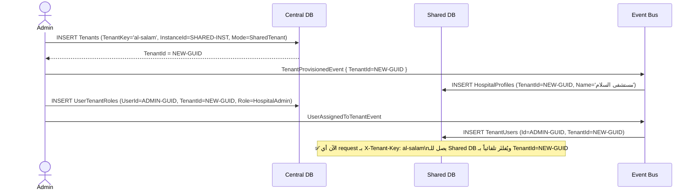

#### السيناريو B: مستشفى ضخمة على Instance معزولة جديدة

```mermaid
sequenceDiagram
    actor Admin
    participant CDB as Central DB
    participant NewDB as New Isolated DB
    participant Bus as Event Bus

    Admin->>CDB: INSERT DatabaseInstances (ConnectionString='Server=cairo-uni;...')
    Admin->>NewDB: EF Migrations (إنشاء كل الجداول)
    Admin->>CDB: UPDATE DatabaseInstances SET IsReady=true
    Admin->>CDB: INSERT Tenants (TenantKey='cairo-uni', InstanceId=NEW-INST, Mode=SoleTenant)
    CDB-->>Admin: TenantId = CAIRO-UNI-GUID

    Admin->>Bus: TenantProvisionedEvent { TenantId=CAIRO-UNI-GUID, IsSole=true }
    Bus->>NewDB: INSERT HospitalProfiles (TenantId=CAIRO-UNI-GUID, ...)
    Bus->>NewDB: INSERT TenantUsers (مدير المستشفى)

    Note over NewDB: ✅ DB معزولة تماماً\nبدون TenantId Filter (SoleTenant)
```

#### السيناريو C: مستشفى ضخمة تضم مستشفى جديدة على نفس الـ Instance

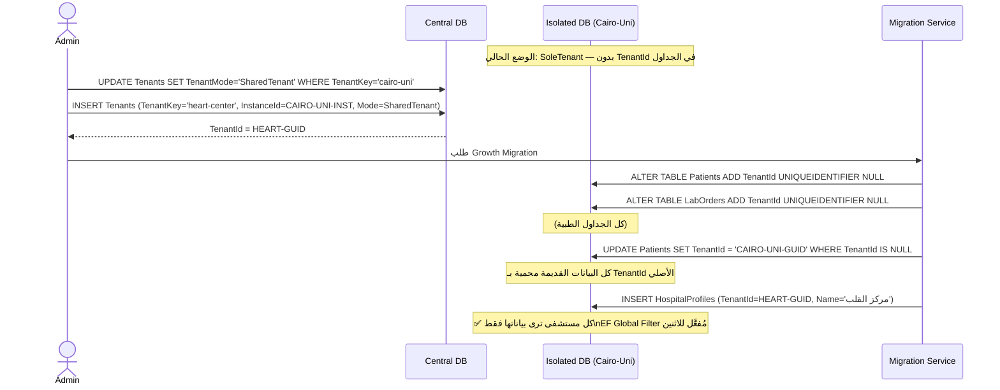

> [!CAUTION]
> Growth Migration تُنفَّذ في Maintenance Window مع Full Backup مسبق.

---

## 8. طبقة الوصول للبيانات

### الإجابة النهائية: كيف تعمل الموديولات مع DB؟

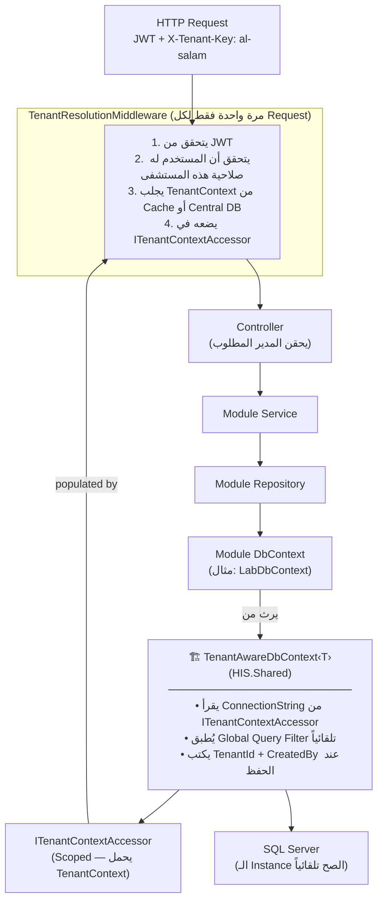

### Middleware الكامل

```csharp
// HIS.Shared/Middleware/TenantResolutionMiddleware.cs
public class TenantResolutionMiddleware
{
    private readonly RequestDelegate _next;
    private readonly IMemoryCache _cache;

    public TenantResolutionMiddleware(RequestDelegate next, IMemoryCache cache)
        => (_next, _cache) = (next, cache);

    public async Task InvokeAsync(HttpContext ctx,
                                   ITenantContextAccessor accessor,
                                   CentralDbContext centralDb)
    {
        // استثناء المسارات العامة
        if (ctx.Request.Path.StartsWithSegments("/api/auth"))
        {
            await _next(ctx); return;
        }

        // 1. قراءة مفتاح المستشفى من الـ Header
        if (!ctx.Request.Headers.TryGetValue("X-Tenant-Key", out var tenantKey))
        {
            ctx.Response.StatusCode = 400;
            await ctx.Response.WriteAsync("X-Tenant-Key header is required.");
            return;
        }

        // 2. التحقق من صلاحية المستخدم على هذه المستشفى (من الـ JWT Claims)
        var allowedTenants = ctx.User.Claims
            .Where(c => c.Type == "tenant_key")
            .Select(c => c.Value)
            .ToHashSet();

        // SystemAdmin له صلاحية على كل شيء
        var isSystemAdmin = ctx.User.HasClaim("scope", "system:admin:full");

        if (!isSystemAdmin && !allowedTenants.Contains(tenantKey.ToString()))
        {
            ctx.Response.StatusCode = 403;
            await ctx.Response.WriteAsync($"Not authorized for tenant '{tenantKey}'.");
            return;
        }

        // 3. جلب TenantContext من Cache أو قاعدة البيانات المركزية
        var cacheKey = $"tenant_ctx_{tenantKey}";
        if (!_cache.TryGetValue(cacheKey, out TenantContext? tenantContext))
        {
            var tenant = await centralDb.Tenants
                .Include(t => t.DatabaseInstance)
                .FirstOrDefaultAsync(t => t.TenantKey == tenantKey.ToString() && t.IsActive);

            if (tenant is null)
            {
                ctx.Response.StatusCode = 404;
                await ctx.Response.WriteAsync($"Tenant '{tenantKey}' not found.");
                return;
            }

            tenantContext = new TenantContext
            {
                TenantId         = tenant.Id,
                TenantKey        = tenant.TenantKey,
                ConnectionString = _encryptor.Decrypt(tenant.DatabaseInstance.ConnectionString),
                Mode             = tenant.TenantMode,
                CurrentUserId    = Guid.Parse(ctx.User.FindFirstValue(ClaimTypes.NameIdentifier)!),
                UserRole         = ctx.User.FindFirstValue($"role_{tenant.TenantKey}") ?? "Viewer"
            };

            _cache.Set(cacheKey, tenantContext, TimeSpan.FromMinutes(15));
        }

        // 4. تسجيل في الـ Accessor — متاح لكل DbContext في هذا الـ Request
        accessor.TenantContext = tenantContext;

        await _next(ctx);
    }
}
```

### الـ Base Class (القلب النابض للمنظومة)

```csharp
// HIS.Shared/Data/TenantAwareDbContext.cs
public abstract class TenantAwareDbContext<TContext> : DbContext
    where TContext : DbContext
{
    protected readonly ITenantContextAccessor TenantAccessor;

    protected TenantAwareDbContext(ITenantContextAccessor tenantAccessor)
        => TenantAccessor = tenantAccessor;

    // ─── 1. الاتصال بالقاعدة الصحيحة ────────────────────────────────────────
    protected override void OnConfiguring(DbContextOptionsBuilder optionsBuilder)
    {
        if (optionsBuilder.IsConfigured) return;

        var connStr = TenantAccessor.TenantContext?.ConnectionString
            ?? throw new InvalidOperationException("Tenant context not set.");

        optionsBuilder.UseSqlServer(connStr, sql =>
        {
            sql.CommandTimeout(30);
            sql.EnableRetryOnFailure(3);
        });
    }

    // ─── 2. الفلتر التلقائي (يُطبَّق فقط على الـ SharedTenant) ──────────────
    protected override void OnModelCreating(ModelBuilder modelBuilder)
    {
        base.OnModelCreating(modelBuilder);

        var isSole     = TenantAccessor.TenantContext?.Mode == TenantMode.SoleTenant;
        var tenantId   = TenantAccessor.TenantContext?.TenantId ?? Guid.Empty;

        if (!isSole)
        {
            foreach (var entityType in modelBuilder.Model.GetEntityTypes())
            {
                if (!typeof(ITenantEntity).IsAssignableFrom(entityType.ClrType)) continue;

                var param      = Expression.Parameter(entityType.ClrType, "e");
                var prop       = Expression.Property(param, nameof(ITenantEntity.TenantId));
                var constant   = Expression.Constant(tenantId);
                var equals     = Expression.Equal(prop, constant);
                var lambda     = Expression.Lambda(equals, param);

                modelBuilder.Entity(entityType.ClrType).HasQueryFilter(lambda);
            }
        }
    }

    // ─── 3. الكتابة التلقائية للـ TenantId والـ Audit Fields ─────────────────
    public override async Task<int> SaveChangesAsync(CancellationToken ct = default)
    {
        var tenantCtx = TenantAccessor.TenantContext
            ?? throw new InvalidOperationException("Cannot save without tenant context.");

        var now = DateTime.UtcNow;

        foreach (var entry in ChangeTracker.Entries())
        {
            if (entry.Entity is ITenantEntity te && entry.State == EntityState.Added)
                te.TenantId = tenantCtx.TenantId;

            if (entry.Entity is IAuditableEntity ae)
            {
                if (entry.State == EntityState.Added)
                {
                    ae.CreatedAt       = now;
                    ae.CreatedByUserId = tenantCtx.CurrentUserId;
                }
                else if (entry.State == EntityState.Modified)
                {
                    ae.UpdatedAt       = now;
                    ae.UpdatedByUserId = tenantCtx.CurrentUserId;
                }
            }
        }

        return await base.SaveChangesAsync(ct);
    }
}
```

### كيف يستخدم كل موديول الـ Base Class

```csharp
// HIS.Modules.Laboratory/Infrastructure/LabDbContext.cs
// اللي بيكتبه المطور هو تعريف الجداول فقط — الباقي تلقائي!
public class LabDbContext : TenantAwareDbContext<LabDbContext>
{
    public LabDbContext(ITenantContextAccessor accessor) : base(accessor) { }

    public DbSet<LabOrder>       LabOrders   => Set<LabOrder>();
    public DbSet<LabResult>      LabResults  => Set<LabResult>();
    public DbSet<TenantUser>     TenantUsers => Set<TenantUser>();
    public DbSet<HospitalProfile> Hospital   => Set<HospitalProfile>();

    protected override void OnModelCreating(ModelBuilder modelBuilder)
    {
        base.OnModelCreating(modelBuilder); // ← الفلتر التلقائي من الـ Base
        modelBuilder.ApplyConfigurationsFromAssembly(typeof(LabDbContext).Assembly);
    }
}
```

---

## 9. الـ Deploy المستقل لكل موديول

### المبدأ: Library + Host خفيف

```
كل موديول =
┌─────────────────────────────────────────┐
│ 📦 HIS.Modules.Laboratory               │
│    (كل Business Logic)                  │
│    Domain / Application / Infrastructure │
│    ← لا يتغير عند الفصل أبداً          │
└─────────────────────────────────────────┘
              +
┌─────────────────────────────────────────┐
│ 📦 HIS.Lab.API (30 سطر فقط)             │
│    Program.cs + Dockerfile               │
│    ← الـ Shell الخفيف للتشغيل           │
└─────────────────────────────────────────┘
```

### الـ Host الخفيف

```csharp
// HIS.Lab.API/Program.cs
var builder = WebApplication.CreateBuilder(args);

builder.Services.AddHISShared(builder.Configuration);
builder.Services.AddHISAuthentication(builder.Configuration);
builder.Services.AddLaboratoryModule(builder.Configuration); // سطر واحد!
builder.Services.AddControllers();
builder.Services.AddSwaggerGen();

var app = builder.Build();
app.UseAuthentication();
app.UseTenantResolution();
app.UseAuthorization();
app.MapControllers();
app.Run();
```

### Dockerfile لكل موديول

```dockerfile
# HIS.Lab.API/Dockerfile
FROM mcr.microsoft.com/dotnet/sdk:8.0 AS build
WORKDIR /src

COPY ["shared/HIS.Shared/HIS.Shared.csproj", "shared/HIS.Shared/"]
COPY ["modules/laboratory/HIS.Modules.Laboratory/HIS.Modules.Laboratory.csproj",
      "modules/laboratory/HIS.Modules.Laboratory/"]
COPY ["modules/laboratory/HIS.Lab.API/HIS.Lab.API.csproj",
      "modules/laboratory/HIS.Lab.API/"]

RUN dotnet restore "modules/laboratory/HIS.Lab.API/HIS.Lab.API.csproj"

COPY shared/HIS.Shared/                             shared/HIS.Shared/
COPY modules/laboratory/HIS.Modules.Laboratory/     modules/laboratory/HIS.Modules.Laboratory/
COPY modules/laboratory/HIS.Lab.API/                modules/laboratory/HIS.Lab.API/

RUN dotnet publish "modules/laboratory/HIS.Lab.API/HIS.Lab.API.csproj" \
    -c Release -o /app/publish

FROM mcr.microsoft.com/dotnet/aspnet:8.0 AS runtime
WORKDIR /app
COPY --from=build /app/publish .
ENTRYPOINT ["dotnet", "HIS.Lab.API.dll"]
```

### سيناريو الـ Deploy المستقل الكامل

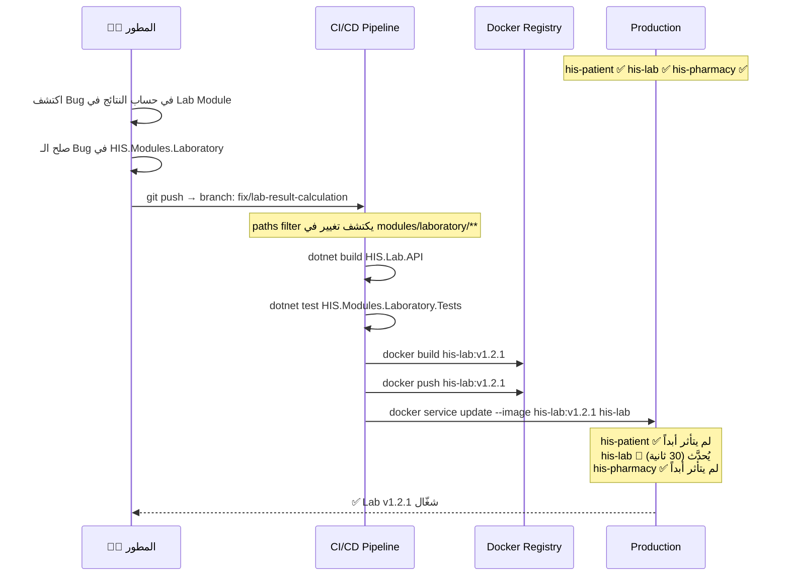

### CI/CD لكل موديول (GitHub Actions)

```yaml
# .github/workflows/lab-module.yml
name: Lab Module CI/CD

on:
  push:
    paths:
      - 'modules/laboratory/**'  # يُشغَّل فقط لو تغير Lab
      - 'shared/HIS.Shared/**'   # أو لو تغير الـ Shared

jobs:
  build-and-deploy:
    runs-on: ubuntu-latest
    steps:
      - uses: actions/checkout@v4
      - name: Build & Test
        run: |
          dotnet build modules/laboratory/HIS.Lab.API/HIS.Lab.API.csproj
          dotnet test modules/laboratory/HIS.Modules.Laboratory.Tests/
      - name: Docker Build & Push
        run: |
          docker build -f modules/laboratory/HIS.Lab.API/Dockerfile \
            -t his-lab:${{ github.sha }} .
          docker push his-lab:${{ github.sha }}
      - name: Deploy Lab Only
        run: |
          docker service update --image his-lab:${{ github.sha }} his-lab
          # ← his-patient, his-pharmacy, his-gateway لم تتأثر أبداً
```

---

## 10. التواصل بين الموديولات

### الأنواع الثلاثة للتواصل

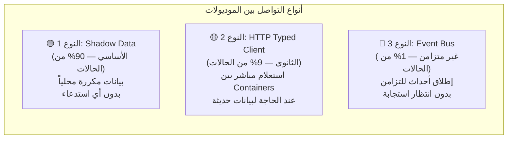

---

### النوع 1: Shadow Data (الأساسي — بدون أي استدعاء)

**المبدأ:** كل موديول يحتفظ بنسخة مصغرة من البيانات التي يحتاجها من الموديولات الأخرى.

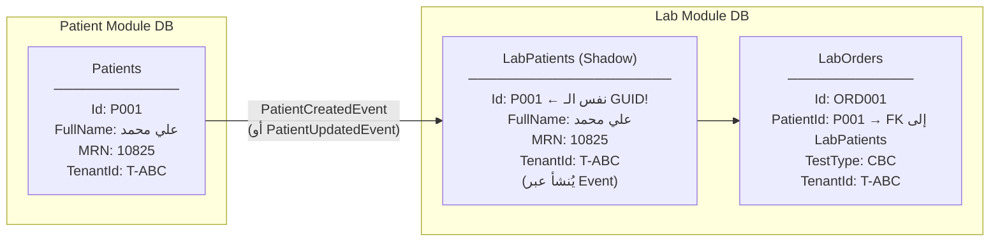

```csharp
// مثال: طلب تحليل للمريض P001 في موديول المختبر
// لا يوجد أي HTTP call لموديول المرضى!
public async Task<LabOrderDto> CreateLabOrderAsync(CreateLabOrderCommand cmd)
{
    // بيانات المريض موجودة محلياً في LabPatients (Shadow)
    var patient = await _labDb.LabPatients.FindAsync(cmd.PatientId)
        ?? throw new NotFoundException($"Patient {cmd.PatientId} not found in lab records.");

    var order = new LabOrder
    {
        Id        = Guid.NewGuid(),
        PatientId = patient.Id,      // FK محلي — بدون Cross-DB
        TestType  = cmd.TestType,
        OrderedBy = cmd.DoctorId,
        Status    = LabOrderStatus.Pending,
        // TenantId يُكتب تلقائياً من TenantAwareDbContext.SaveChangesAsync
    };

    _labDb.LabOrders.Add(order);
    await _labDb.SaveChangesAsync();

    return order.ToDto(patient); // كل البيانات محلية ✅
}
```

---

### النوع 2: HTTP Typed Client (للحالات التي تحتاج بيانات حديثة جداً)

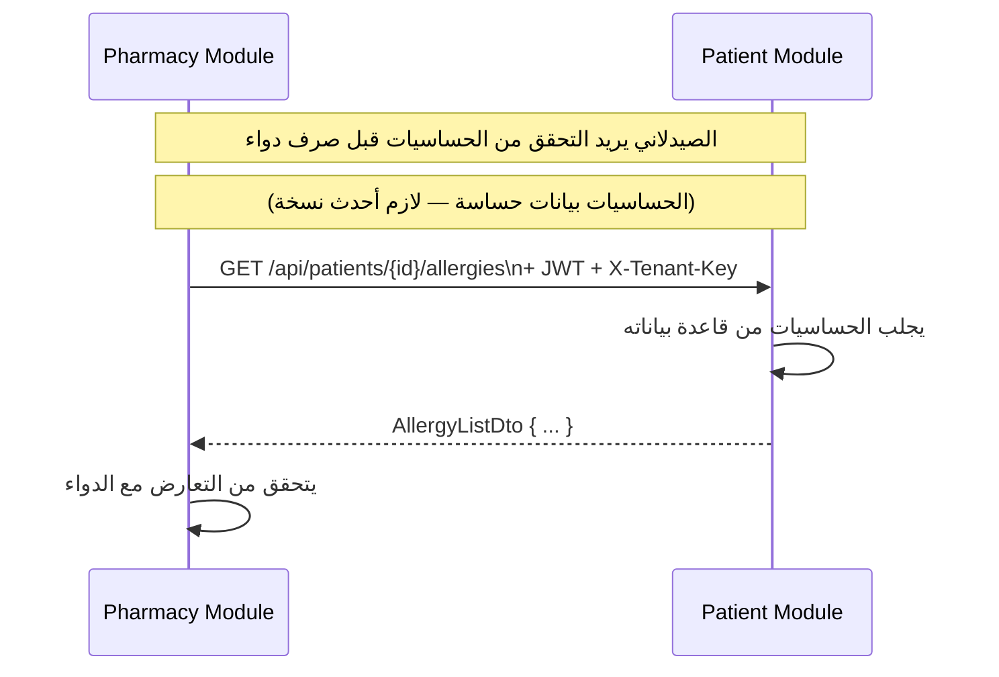

```csharp
// HIS.Shared/Clients/IPatientModuleClient.cs
public interface IPatientModuleClient
{
    Task<AllergyListDto?>       GetPatientAllergiesAsync(Guid patientId, string tenantKey, CancellationToken ct = default);
    Task<PatientSummaryDto?>    GetPatientSummaryAsync(Guid patientId, string tenantKey, CancellationToken ct = default);
    Task<ActiveMedicationsDto?> GetActiveMedicationsAsync(Guid patientId, string tenantKey, CancellationToken ct = default);
}

// HIS.Shared/Clients/PatientModuleClient.cs
public class PatientModuleClient : IPatientModuleClient
{
    private readonly HttpClient _http;
    private readonly ITenantContextAccessor _tenantAccessor;

    public PatientModuleClient(HttpClient http, ITenantContextAccessor accessor)
        => (_http, _tenantAccessor) = (http, accessor);

    public async Task<AllergyListDto?> GetPatientAllergiesAsync(
        Guid patientId, string tenantKey, CancellationToken ct)
    {
        // يُمرَّر نفس الـ JWT والـ Tenant Header للموديول الآخر
        _http.DefaultRequestHeaders.Remove("X-Tenant-Key");
        _http.DefaultRequestHeaders.Add("X-Tenant-Key", tenantKey);

        return await _http.GetFromJsonAsync<AllergyListDto>(
            $"/api/patients/{patientId}/allergies", ct);
    }
}

// HIS.Pharmacy.API/Program.cs — التسجيل
builder.Services.AddHttpClient<IPatientModuleClient, PatientModuleClient>(client =>
{
    client.BaseAddress = new Uri(builder.Configuration["Services:PatientUrl"]!);
    client.Timeout = TimeSpan.FromSeconds(10);
})
.AddStandardResilienceHandler(); // Retry + Circuit Breaker تلقائي

// في docker-compose.yml:
// Services__PatientUrl=http://his-patient:5001
```

**الاستخدام في الـ Pharmacy:**
```csharp
// HIS.Modules.Pharmacy/Application/Services/PrescriptionService.cs
public async Task<PrescriptionResult> DispenseMedicationAsync(DispenseCommand cmd)
{
    var tenantKey = _tenantAccessor.TenantContext!.TenantKey;

    // جلب الحساسيات من Patient Module مباشرةً (بيانات حساسة = لازم أحدث نسخة)
    var allergies = await _patientClient.GetPatientAllergiesAsync(cmd.PatientId, tenantKey);

    // التحقق من التعارض
    if (allergies?.Items.Any(a => a.SubstanceName == cmd.DrugName) == true)
        throw new AllergyConflictException($"تحذير: المريض لديه حساسية من {cmd.DrugName}");

    // صرف الدواء
    var prescription = new Prescription { ... };
    _pharmacyDb.Prescriptions.Add(prescription);
    await _pharmacyDb.SaveChangesAsync();

    return PrescriptionResult.Success(prescription);
}
```

---

### النوع 3: Event Bus (للمزامنة غير المتزامنة)

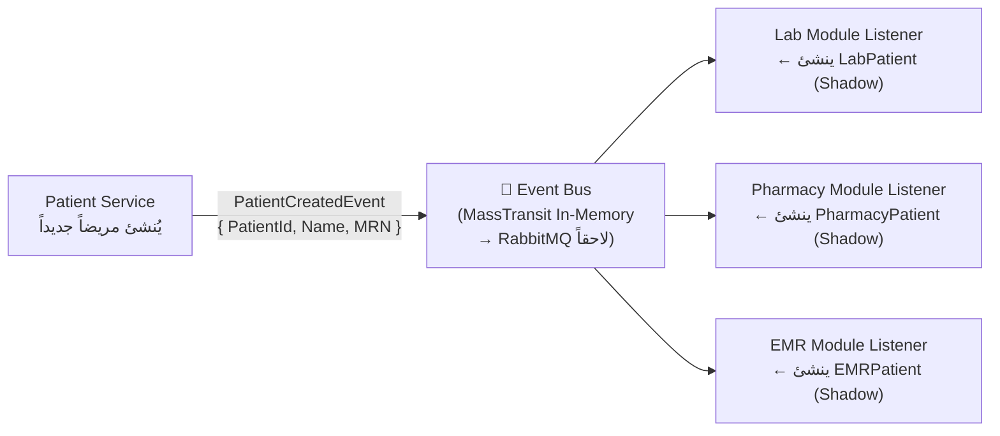

```csharp
// HIS.Modules.Patient/Application/Events/PatientCreatedEvent.cs
public record PatientCreatedEvent(
    Guid   PatientId,
    string FullName,
    string MRN,
    Guid   TenantId,
    string TenantKey
);

// إطلاق الحدث بعد حفظ المريض
public class CreatePatientCommandHandler
{
    public async Task<Guid> Handle(CreatePatientCommand cmd, CancellationToken ct)
    {
        var patient = new Patient { Id = Guid.NewGuid(), ... };
        _db.Patients.Add(patient);
        await _db.SaveChangesAsync(ct);

        // إطلاق الحدث — لا ننتظر الاستجابة (Fire and Forget)
        await _eventBus.PublishAsync(new PatientCreatedEvent(
            patient.Id,
            patient.FullName,
            patient.MRN,
            _tenantAccessor.TenantContext!.TenantId,
            _tenantAccessor.TenantContext!.TenantKey
        ), ct);

        return patient.Id;
    }
}

// الاستماع في Lab Module
public class PatientCreatedEventHandler : IConsumer<PatientCreatedEvent>
{
    public async Task Consume(ConsumeContext<PatientCreatedEvent> ctx)
    {
        var ev = ctx.Message;
        var tenantCtx = await _registry.GetTenantContextAsync(ev.TenantId);
        using var labDb = _dbFactory.CreateFor(tenantCtx);

        labDb.LabPatients.Add(new LabPatient
        {
            Id       = ev.PatientId,  // نفس الـ GUID!
            FullName = ev.FullName,
            MRN      = ev.MRN,
            TenantId = ev.TenantId
        });
        await labDb.SaveChangesAsync();
    }
}
```

---

### سيناريو واقعي كامل: طلب تحليل دم للمريض علي محمد

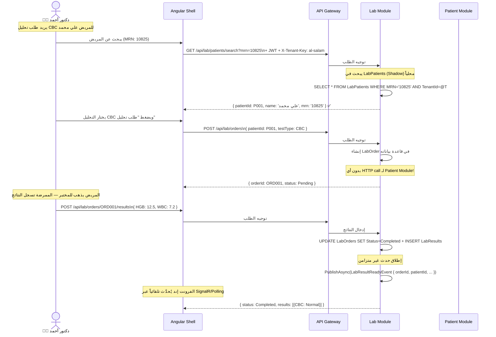

---

## 11. هيكل الـ Solution وخطة التنفيذ

### الهيكل الكامل للمشاريع

```
his-backend/
│
├── 📄 HIS.Backend.sln
│
├── 📁 gateway/
│   └── 📦 HIS.Gateway                      ← YARP — 10 سطر فقط
│       ├── appsettings.json                 ← تعريف الـ Routes
│       ├── Program.cs
│       └── Dockerfile
│
├── 📁 identity/
│   └── 📦 HIS.Identity.API                 ← Auth Service مستقل
│       ├── Domain/
│       │   └── Entities/
│       │       ├── CentralUser.cs
│       │       ├── Tenant.cs
│       │       ├── DatabaseInstance.cs
│       │       ├── HospitalGroup.cs
│       │       ├── UserTenantRole.cs
│       │       ├── GroupAdminAssignment.cs
│       │       └── RefreshToken.cs
│       ├── Application/
│       │   ├── Commands/
│       │   │   ├── LoginCommand + Handler
│       │   │   ├── RegisterUserCommand + Handler
│       │   │   ├── AssignUserToTenantCommand + Handler
│       │   │   └── ProvisionDatabaseInstanceCommand + Handler
│       │   └── Queries/
│       │       └── GetUserTenantsQuery + Handler
│       ├── Infrastructure/
│       │   ├── CentralDbContext.cs
│       │   └── Migrations/
│       ├── Presentation/
│       │   ├── AuthController.cs
│       │   └── GroupManagementController.cs
│       ├── Program.cs
│       └── Dockerfile
│
├── 📁 shared/
│   └── 📦 HIS.Shared                       ← المكتبة المشتركة الوحيدة
│       ├── Tenancy/
│       │   ├── ITenantContextAccessor.cs
│       │   ├── TenantContextAccessor.cs
│       │   └── TenantContext.cs
│       ├── Data/
│       │   └── TenantAwareDbContext.cs      ← Base Class الأساسي
│       ├── Interfaces/
│       │   ├── ITenantEntity.cs
│       │   └── IAuditableEntity.cs
│       ├── Middleware/
│       │   └── TenantResolutionMiddleware.cs
│       ├── Authorization/
│       │   └── HISPolicies.cs
│       ├── Clients/
│       │   ├── IPatientModuleClient.cs      ← HTTP Client للتواصل بين الموديولات
│       │   └── PatientModuleClient.cs
│       ├── Events/
│       │   ├── PatientCreatedEvent.cs
│       │   ├── LabResultReadyEvent.cs
│       │   └── UserAssignedToTenantEvent.cs
│       └── Extensions/
│           └── HISSharedExtensions.cs       ← AddHISShared() Extension Method
│
└── 📁 modules/
    │
    ├── 📁 patient/
    │   ├── 📦 HIS.Modules.Patient           ← Library (كل الكود الطبي)
    │   │   ├── Domain/
    │   │   │   └── Entities/
    │   │   │       ├── Patient.cs           ← implements ITenantEntity, IAuditableEntity
    │   │   │       └── PatientAllergy.cs
    │   │   ├── Application/
    │   │   │   ├── Commands/
    │   │   │   └── Queries/
    │   │   ├── Infrastructure/
    │   │   │   ├── PatientDbContext.cs      ← يرث من TenantAwareDbContext
    │   │   │   └── Migrations/
    │   │   └── Presentation/
    │   │       └── PatientsController.cs
    │   └── 📦 HIS.Patient.API               ← Host خفيف
    │       ├── Program.cs
    │       └── Dockerfile
    │
    ├── 📁 laboratory/
    │   ├── 📦 HIS.Modules.Laboratory
    │   │   ├── Domain/Entities/
    │   │   │   ├── LabOrder.cs
    │   │   │   ├── LabResult.cs
    │   │   │   └── LabPatient.cs            ← Shadow من Patient Module
    │   │   ├── Application/
    │   │   ├── Infrastructure/
    │   │   │   ├── LabDbContext.cs
    │   │   │   └── Migrations/
    │   │   └── Presentation/
    │   │       └── LabController.cs
    │   └── 📦 HIS.Lab.API
    │       ├── Program.cs
    │       └── Dockerfile
    │
    ├── 📁 pharmacy/
    │   ├── 📦 HIS.Modules.Pharmacy
    │   └── 📦 HIS.Pharmacy.API
    │
    └── 📁 emr/
        ├── 📦 HIS.Modules.EMR
        └── 📦 HIS.EMR.API
```

---

### Docker Compose الكامل

```yaml
# docker-compose.yml
services:

  central-db:
    image: mcr.microsoft.com/mssql/server:2022-latest
    environment:
      SA_PASSWORD: "${DB_SA_PASSWORD}"
      ACCEPT_EULA: "Y"
    ports: ["1433:1433"]
    volumes: ["central-db-data:/var/opt/mssql"]
    healthcheck:
      test: /opt/mssql-tools/bin/sqlcmd -S localhost -U sa -P "${DB_SA_PASSWORD}" -Q "SELECT 1"
      interval: 10s
      retries: 10

  his-gateway:
    build: { context: ., dockerfile: gateway/HIS.Gateway/Dockerfile }
    ports: ["80:8080", "443:8443"]
    depends_on: [his-identity]

  his-identity:
    build: { context: ., dockerfile: identity/HIS.Identity.API/Dockerfile }
    environment:
      ConnectionStrings__CentralDb: "Server=central-db;Database=HIS_Central;User Id=sa;Password=${DB_SA_PASSWORD};TrustServerCertificate=True"
      Jwt__SecretKey: "${JWT_SECRET_KEY}"
      Jwt__Issuer: "his-platform"
      Jwt__Audience: "his-clients"
      Jwt__ExpiryMinutes: "60"
    depends_on:
      central-db: { condition: service_healthy }

  his-patient:
    build: { context: ., dockerfile: modules/patient/HIS.Patient.API/Dockerfile }
    environment:
      ConnectionStrings__CentralDb: "Server=central-db;Database=HIS_Central;..."
      Jwt__SecretKey: "${JWT_SECRET_KEY}"
      Services__PatientUrl: "http://his-patient:5001"
    depends_on: [central-db, his-identity]

  his-lab:
    build: { context: ., dockerfile: modules/laboratory/HIS.Lab.API/Dockerfile }
    environment:
      ConnectionStrings__CentralDb: "Server=central-db;Database=HIS_Central;..."
      Jwt__SecretKey: "${JWT_SECRET_KEY}"
      Services__PatientUrl: "http://his-patient:5001"
    depends_on: [central-db, his-identity]

  his-pharmacy:
    build: { context: ., dockerfile: modules/pharmacy/HIS.Pharmacy.API/Dockerfile }
    environment:
      ConnectionStrings__CentralDb: "Server=central-db;Database=HIS_Central;..."
      Jwt__SecretKey: "${JWT_SECRET_KEY}"
      Services__PatientUrl: "http://his-patient:5001"
    depends_on: [central-db, his-identity]

  his-emr:
    build: { context: ., dockerfile: modules/emr/HIS.EMR.API/Dockerfile }
    environment:
      ConnectionStrings__CentralDb: "Server=central-db;Database=HIS_Central;..."
      Jwt__SecretKey: "${JWT_SECRET_KEY}"
    depends_on: [central-db, his-identity]

volumes:
  central-db-data:
```

---

### خطة التنفيذ التدريجية

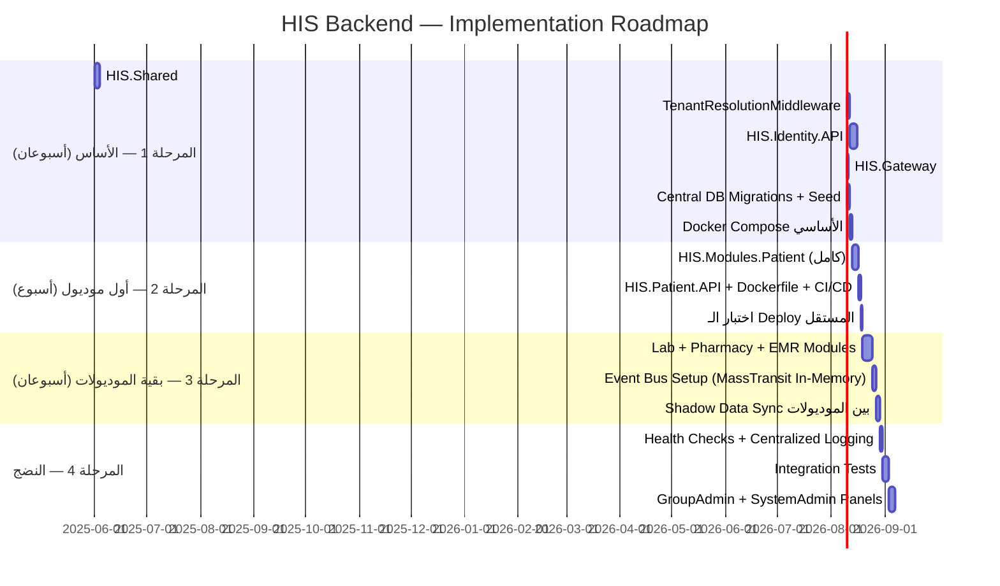

---

## 📊 ملخص القرارات الكاملة

| القرار | التفصيل |
|:---|:---|
| **Framework** | .NET 8 + ASP.NET Core WebAPI |
| **ORM** | Entity Framework Core 8 + SQL Server |
| **Authentication** | JWT Bearer + Refresh Tokens |
| **Gateway** | YARP Reverse Proxy |
| **Event Bus** | MassTransit (In-Memory → RabbitMQ لاحقاً) |
| **Cross-Module HTTP** | Typed HttpClient مع Resilience Handler |
| **Central DB** | 7 جداول: Users, Groups, Instances, Tenants, UserRoles, GroupAdmins, Tokens |
| **Tenant Isolation** | EF Global Query Filter (SharedTenant) / بدون فلتر (SoleTenant) |
| **User Linking** | Shadow User بنفس الـ GUID — لا Cross-DB Joins |
| **Hospital Linking** | HospitalProfile بنفس الـ TenantId GUID |
| **DAL Pattern** | TenantAwareDbContext Base Class — DbContext مستقل لكل موديول |
| **Deployment** | كل موديول = Library + Host خفيف + Container مستقل |
| **CI/CD** | GitHub Actions مع paths filter — يُشغَّل فقط للموديول المتغير |
| **User Types** | 3 مستويات: HospitalUser / GroupAdmin / SystemAdmin |
| **Tenancy Modes** | SoleTenant (بدون Filter) / SharedTenant (مع Filter) |
| **Growth Migration** | إضافة TenantId لجداول SoleTenant عند انضمام مستشفى جديدة |

> [!IMPORTANT]
> **الخطوة التالية:** بعد الموافقة على هذا التصور الكامل، سنبدأ في إنشاء هيكل الـ Solution الفعلي داخل مجلد `his-backend` مع أول `Migration` للـ Central DB وكل ملفات الـ C# الأساسية.
