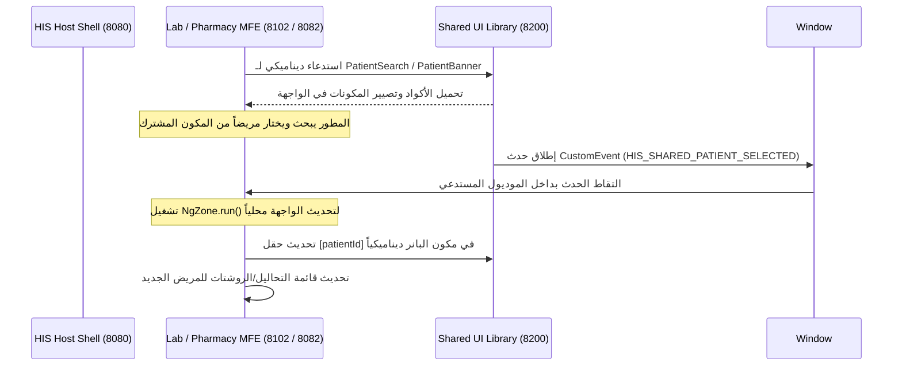

# دليل هندسة المكتبات المشتركة والاتصال التفاعلي بين الـ Micro Frontends

يركز هذا الدليل على شرح معمارية وتفاصيل هندسة **مكتبة المكونات المشتركة (`his-shared-lib`)** وكيفية تواصل موديولات الـ Micro Frontends بشكل تفاعلي وآمن في نظام HIS الصحي. تم تصميم هذا التوثيق ليكون مرجعاً للمطورين لشرح البنية الحالية وكيفية التوسع فيها مستقبلاً.

---

## 🗺️ الفلسفة والهدف العام (The Core Philosophy)

في تطبيقات الـ Micro Frontends الضخمة، توجد مكونات واجهة مستخدم (UI Components) متكررة ويتم طلبها في أكثر من موديول مستمر. بدلاً من تكرار كتابة الكود الخاص بها (كود البحث عن المرضى، أو شريط معلومات المريض) في كل تطبيق فرعي، قمنا بفصلها بالكامل داخل تطبيق مستقل يُسمى **المكتبة المشتركة (`his-shared-lib`)** يعمل على منفذ منفصل (`8200`) ويتم استدعاء مكوناته **ديناميكياً أثناء وقت التشغيل (Runtime Dynamic Loading)**.

---

## 🏗️ البنية الهندسية وتدفق البيانات (System Architecture)

يعتمد النظام على ركيزتين أساسيتين لضمان العمل التكاملي المستقل:
1. **التحميل الديناميكي الموحد (Native Federation)**: استخدام معيار استدعاء الموديولات في المتصفح لاستيراد المكونات الفرعية بدون تحميل مسبق أو حزم مكررة.
2. **بروتوكول الأحداث المخصصة المشتركة (Decoupled CustomEvents)**: ربط المكونات ببعضها عند التشغيل داخل موديولات منفصلة عبر ناقل أحداث المتصفح العام (Window Global Event Bus)، مدمجاً بـ `NgZone` لضمان التحديث اللحظي للواجهات في تطبيقات Angular.



---

## 💻 المكونات المشتركة بالتفصيل

### 1. شريط بيانات المريض (`PatientBannerComponent`)
مكون تفاعلي يعرض ملف المريض، حالته الصحية الحالية، الطبيب المعالج، وتاريخ دخوله للمستشفى.

* **المدخلات (Inputs)**: يستقبل `@Input() patientId: string` ليقوم تلقائياً بتحديث البيانات وتصفية السجلات داخلياً استناداً للمعرف الممرر.
* **الوسم البصري**: يحتوي على علامة برمجية بارزة `Shared Component 💎` وشريط مائل في المتصفح لإبراز المعمارية بوضوح تام.

### 2. محرك البحث الذكي (`PatientSearchComponent`)
حقل بحث متقدم مع ميزة الإكمال التلقائي (Autocomplete) يُظهر قائمة المرضى المطابقين للاسم أو رقم الملف الطبي (MRN) بمجرد الكتابة.

* **المخرجات (Outputs)**: يُصدر `@Output() patientSelected` للمستخدمين داخل نفس التطبيق.
* **البث العام (Global Event Dispatch)**: يقوم بنشر حدث عام للمتصفح عند الضغط على اختيار مريض:
  ```typescript
  window.dispatchEvent(new CustomEvent('HIS_SHARED_PATIENT_SELECTED', {
    detail: patient // يحتوي على المعرف والاسم والعمر
  }));
  ```

---

## 🔄 آلية الاتصال التفاعلي المستقل (Reactive Decoupled Communication)

بما أن الموديولات تُحمل ديناميكياً في الـ DOM، فإن مستمعي الأحداث التقليديين لن ينجحوا في تمرير البيانات المباشرة. قمنا بحل هذه المشكلة عبر **ناقل الأحداث المخصص (CustomEvents Global Bus)**.

### تحديث الواجهات اللحظي باستخدام `NgZone`
مستمعو أحداث المتصفح مثل `window.addEventListener` يعملون خارج إطار عمل حلقة الفحص لـ Angular (Change Detection Loop). لتفادي تأخر تحديث الواجهات البرمجية، نلتزم بإجبار مستمعي الأحداث على العمل داخل حقل حماية Angular `Zone`:

```typescript
import { Component, OnInit, NgZone, ViewChild, ViewContainerRef } from '@angular/core';

// داخل الموديول المستورد (مثل Lab MFE أو Pharmacy MFE)
constructor(private ngZone: NgZone) {}

ngOnInit() {
  window.addEventListener('HIS_SHARED_PATIENT_SELECTED', (e: any) => {
    // إجبار التحديث اللحظي للـ DOM فور وصول الحدث
    this.ngZone.run(() => {
      const selectedPatient = e.detail;
      this.currentPatientId = selectedPatient.id;
      this.loadResults(); // تحديث التحاليل الطبية أو الروشتات الخاصة بالمريض
      
      // تمرير الهوية المحدثة ديناميكياً للبانر المشترك
      if (this.bannerRef) {
        this.bannerRef.instance.patientId = selectedPatient.id;
        this.bannerRef.changeDetectorRef.detectChanges();
      }
    });
  });
}
```

---

## 🚀 طريقة التهيئة البرمجية للاستدعاء الديناميكي (Dynamic Loading Example)

لتحميل أحد المكونات المشتركة من موديول خارجي دون الحاجة لربطه مسبقاً أثناء البناء (Build-time)، نستخدم الـ `ViewContainerRef` بالتكامل مع المفسر الديناميكي لـ `Native Federation`:

```typescript
import { loadRemoteModule } from '@angular-architects/native-federation';

// مرجع العنصر في ملف الـ HTML: <ng-container #bannerHost></ng-container>
@ViewChild('bannerHost', { read: ViewContainerRef, static: true }) bannerHost!: ViewContainerRef;
bannerRef: any = null;

async loadSharedBanner() {
  try {
    // تحميل الموديول ديناميكياً من منفذ المكتبة المشتركة
    const module = await loadRemoteModule({
      remoteEntry: 'http://localhost:8200/remoteEntry.json',
      exposedModule: './PatientBanner' // تم تعريفه في federation.config.js الخاصة بالمكتبة
    });
    
    const componentClass = module['PatientBannerComponent'];
    this.bannerHost.clear();
    
    // إنشاء الكومبوننت وحقنه في المتصفح
    this.bannerRef = this.bannerHost.createComponent(componentClass);
    
    // تمرير المتغيرات الابتدائية
    this.bannerRef.instance.patientId = this.currentPatientId;
    this.bannerRef.changeDetectorRef.detectChanges();
  } catch (error) {
    console.error('فشل تحميل البانر الطبي المشترك:', error);
  }
}
```

---

## 🛠️ كيف تضيف مكوناً جديداً للمكتبة المشتركة وتشاركه بالنظام؟

إذا رغبت في إضافة مكون مشترك جديد مستقبلاً (مثل شاشة المؤشرات الحيوية المشتركة أو حاسبة الجرعات الدوائية)، اتبع الخطوات التالية:

### الخطوة 1: إنشاء المكون في المكتبة المشتركة
قم بإنشاء الكومبوننت كـ `standalone: true` داخل مجلد `src/lib/` للمكتبة المشتركة:
```bash
# إنشاء مجلد جديد ومكون للمؤشرات الحيوية
E:\HealthOperations_Anti\his-shared-lib\src\lib\patient-vitals\...
```

### الخطوة 2: تصدير المكون في إعدادات الفيدريشن (`federation.config.js`)
قم بتسجيل المسار والاسم المستعار في قائمة المكونات المصدرة (`exposes`) داخل ملف [federation.config.js](file:///E:/HealthOperations_Anti/his-shared-lib/federation.config.js):
```javascript
exposes: {
  './PatientBanner': './src/lib/patient-banner/patient-banner.component.ts',
  './PatientSearch': './src/lib/patient-search/patient-search.component.ts',
  './PatientVitals': './src/lib/patient-vitals/patient-vitals.component.ts' // المكون الجديد
},
```

### الخطوة 3: بناء وتشغيل التطبيق
قم بإعادة بناء وتشغيل المكتبة المشتركة ليتم إدراج الكود الجديد في ملف `remoteEntry.json`:
```bash
docker-compose up -d --build his-shared-lib
```

### الخطوة 4: استدعاؤه في أي موديول فرعي
يمكنك الآن استدعاء الكومبوننت الجديد من موديول المختبر، الصيدلية، EMR، أو الشيل الرئيسي ديناميكياً بنفس الطريقة البرمجية الموضحة أعلاه باستخدام الاسم المستعار `./PatientVitals`.

---

## 🌐 تهيئة Nginx و CORS لتفادي مشاكل الحماية

بما أن المكونات تُحمل من خوادم ومنافذ مختلفة عبر المتصفح (`http://localhost:8200` إلى `http://localhost:8102` و `8080`)، يجب تفعيل سياسة مشاركة الموارد من مصادر مختلفة (CORS). 

يتم حماية وضمان ذلك عبر إعداد خادم Nginx للمكتبة المشتركة لإرسال الترويسات الصحيحة دائماً في ملف [nginx.conf](file:///E:/HealthOperations_Anti/his-shared-lib/nginx.conf):
```nginx
server {
    listen 80;
    server_name localhost;
    root /usr/share/nginx/html;
    index index.html;

    # تفعيل CORS بالكامل لمشاركة ملفات الجافاسكريبت والـ json بأمان
    add_header Access-Control-Allow-Origin *;
    add_header Access-Control-Allow-Methods 'GET, POST, OPTIONS';
    add_header Access-Control-Allow-Headers 'DNT,User-Agent,X-Requested-With,If-Modified-Since,Cache-Control,Content-Type,Range';

    location / {
        try_files $uri $uri/ /index.html;
    }
}
```

---

*تم كتابة وتدقيق هذا المستند ليكون الدليل المرجعي الهيكلي لنظام المستشفى الرقمي HIS الشامل.* 💎🔬💊
